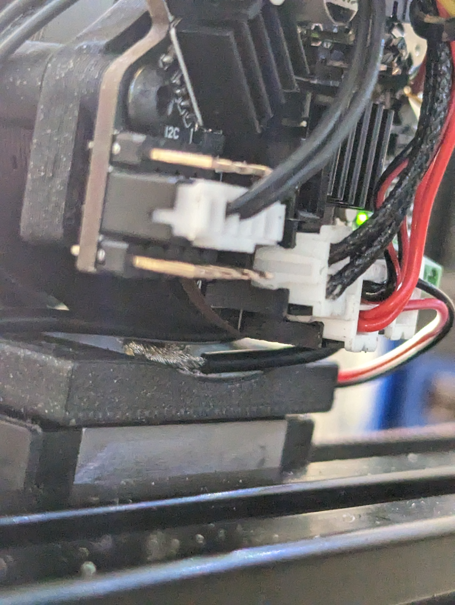
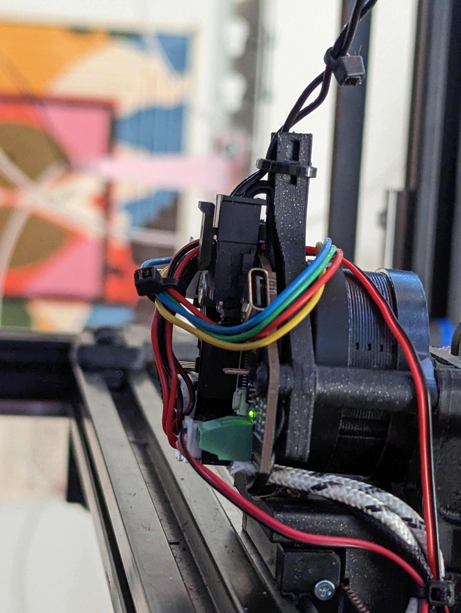
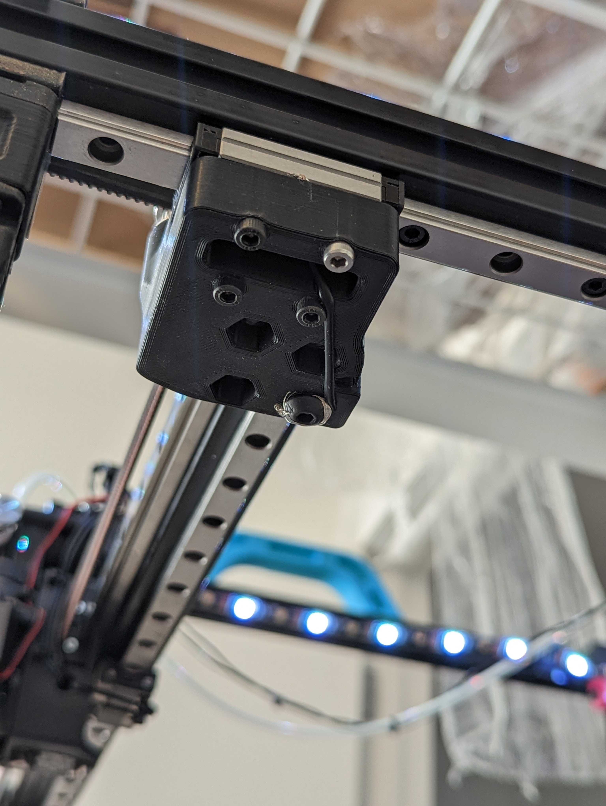
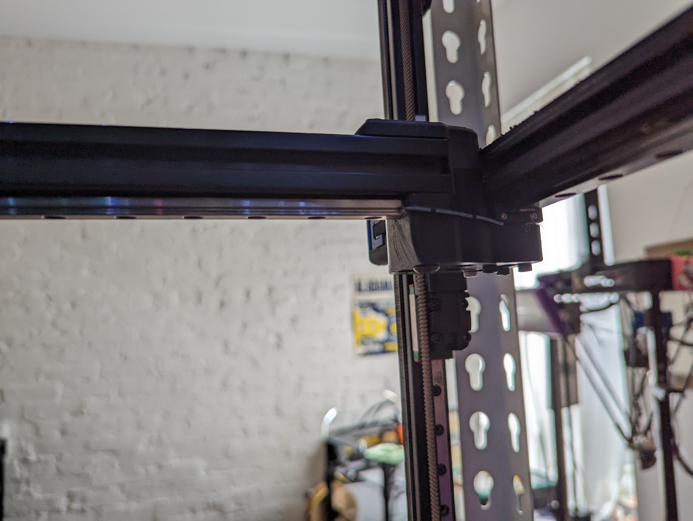
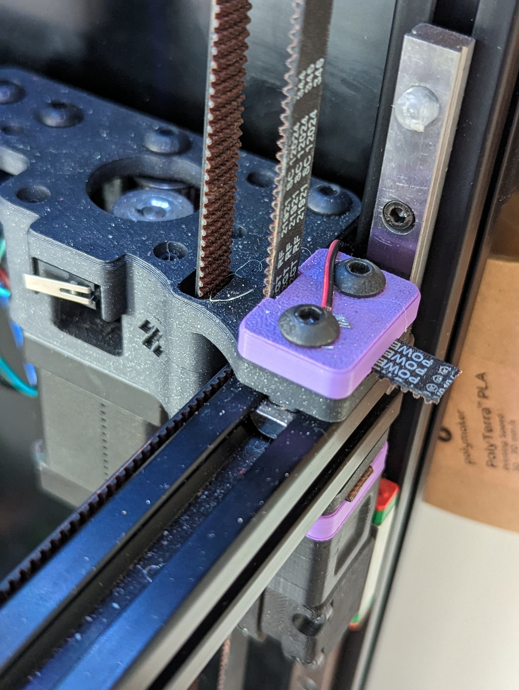
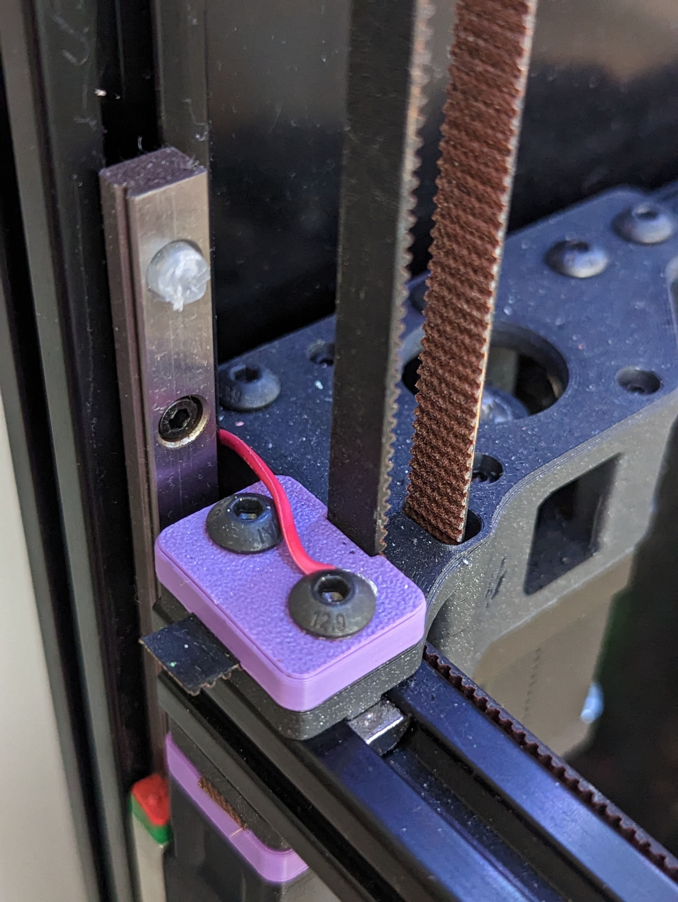

# RailCANon

## Please don't do this.

April fools!
Sorry to burst your bubble, but 2CAN doesn't exist. (Well, not yet... stay tuned)

Instead, the [2CAN serial video](https://www.reddit.com/r/voroncorexy/comments/128ptla/look_ma_2_wires_24_serial_request_bwnance1508/) was done with something even stupider:

**Power Over Rail**

If a linear rail is high quality, has reasonably high preload, and isn't greased, then it conducts electricity _surprisingly_ well. In some (admittedly low-sample size) tests, it was found that rails fitting these criteria measure around 0.4-0.6 ohms between the carriage and the rail. 

A side effect of the 2.4's design is that all 4 extrusions that comprise the gantry are electrically isolated from each other by the printed parts. This means, in effect, that we could run V+ through one Y rail and V- through another. If one could find a way to get V+ and V- to the toolhead without shorting them together, they would be able to run power to their toolhead over rails!

And that's exactly what we did. By floating a second rail underneath the X extrusion, we were able to run v+ over that second rail, while wiring V- to the existing MGN12 and extrusion. With some ~~jank as hell~~ ingenious and well-thought-out wiring between carriages and rails, etc, and some wire hiding, the 2CAN printer was born (in about 6 hours the day before April first).

I think it goes without saying, but ***DO NOT DO THIS***. This printer has around 14A of live 24v flowing through completely unprotected rails and especially on the X rail, both V- and V+ are dangerously close to each other. 

We did this *because* it was stupid, and it made us laugh our asses off. This "mod" will be dismantled after April first, never to be seen again (at least... not in this incredibly dangerous form).

Please enjoy these photos of the beautiful jank that was, for a brief time, RailCANon, and don't forget: *Commit Atrocity Everyday*.

